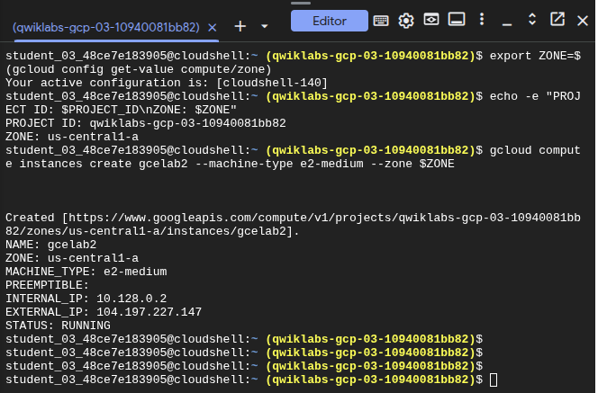
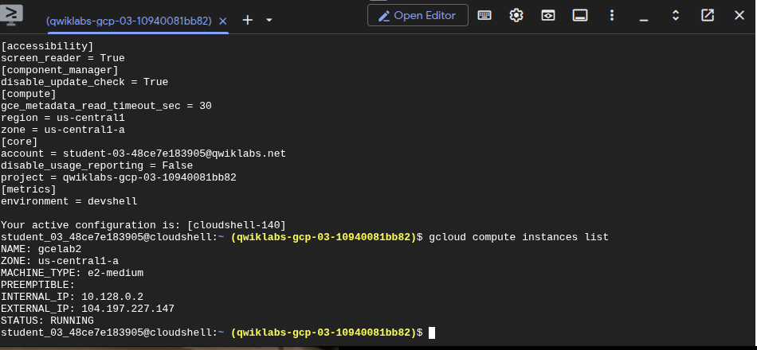
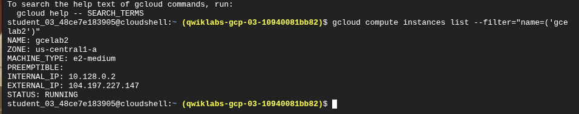
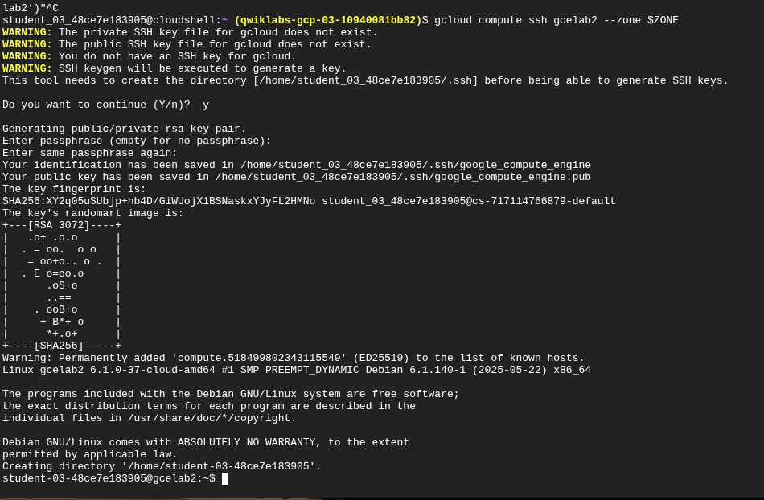
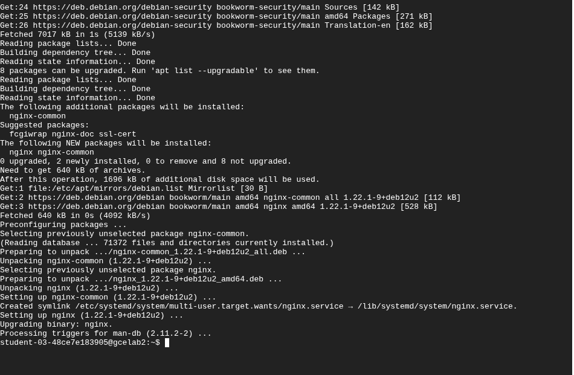
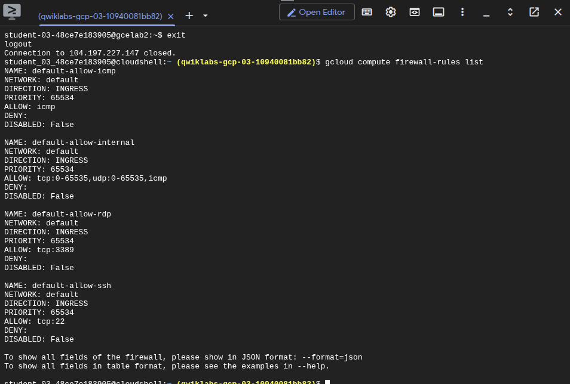
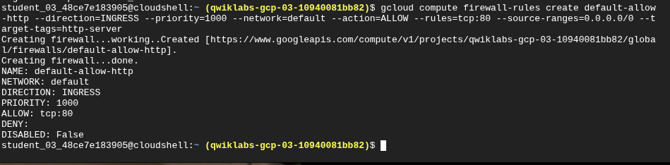

st# GCP
GCP Labs and Building

## Scope
This project contains a variaty of GCP tasks related to the console and cloud shell (CLI).

## Environment & Services
- GCP Console
- GCP Cloudshell 
- GCP Compute
- GCP IAM
- GCP APIs

## Tasks

### Review currently available projects in the console.

### Access Management Services then the API service.

### Create a new principal and then confirm it only has the viewer role assigned.

### Confirm the roles assigned to each principal.

### Enable the Dialogflow API and confirm this service is now usable with the current principal in use.

### Confirm the region, change to a different zone in the region, validate new zone is active. 

### Export the PROJECT and ZONE paramaters to applicable VARs then echo the output to the cloud shell terminal.

### Create an e2-medium VM using the $ZONE variable for location.

### List out VMs to cloud shell.

### List out instances to cloud shell, filtering for the VM that was just created.

### Create RSA keypair for new VM, assign to active zone, validate SSH functionality in cloudshell.

### Installing NGINX on new VM.

### List out current firewall rules for compute, validate if enabled or not.

### Create new ingress firewall rule for compute that allows TCP80 (HTTP), set priority and tag(s), validate rule is set on the VM - filter for  port 80.

