## Scope
This repo contains various operational cloud engineering tasks inside of GCP, covering multiple core services as well as infrastructure provisioning. It is being used to prepare for both the Cloud Digital Leader and the Associate Cloud Engineer certifications. Additionally, it will be greatly expanded for a Terraform infra project I have mapped out I will be starting later in 2025.

## Environment & Services
- GCP Console
- GCP Cloudshell 
- gcloud CLI
- GCP Compute
- GCP IAM
- GCP API

```
├── README.md
├── Screenshots
│   ├── APIAppEngine/
│   ├── BillingSpend/
│   ├── CloudRun/
│   ├── Compute/
│   ├── ConsoleAPIIAM/
│   ├── GKE/
├── APIAppEngine
│   └── Create, deploy, update and validate
├── BillingSpend
│   └── Forecasting, investigating, filtering, projecting
├── CloudRun
│   ├── Build, deploy testing functionality
│   └── Update the application, repo creation, validate functionality, application updating, concurrency testing, website build and deploy - no downtime
├── Compute
│   └── Create VMs, configure RSA pairs, firewall rules, NGINX validation and install
├── ConsoleAPIIAM
│   └── Review available projects, create/manage principals, zone management and exporting
├── GKE
│   └── Set region and zones, cluster creation, IP validation, IP validation and management
```

## Services & Tasks

### APIAppEngine 
2025-07-27 Enable the App Engine Admin API using the console.   
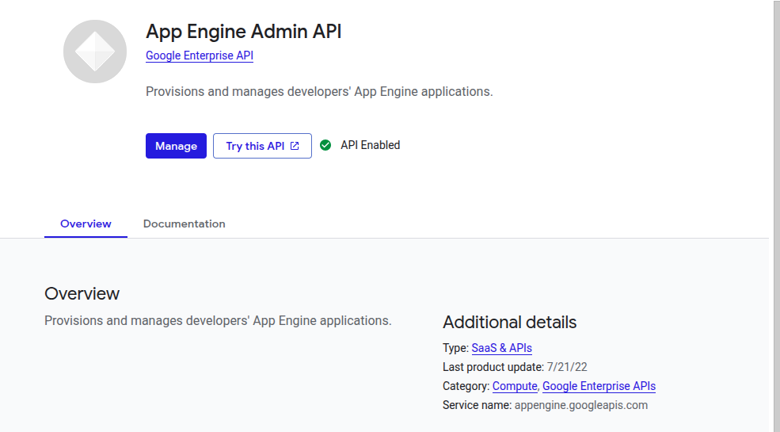
2025-07-27 Clone the "Hello World" Python repo from GitHub to the project, update the OS, then setup the Python env.    
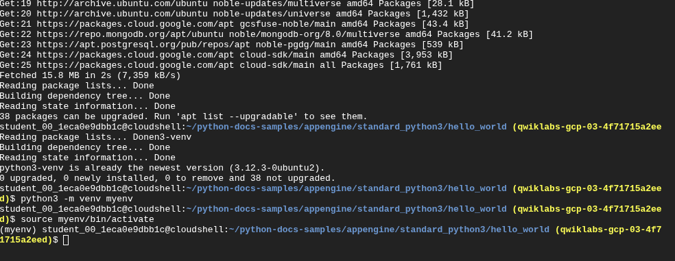
2025-07-27 Validate the app is accessible from a browser.   

2025-07-27 Start the web server, validate the accessibility, then stop the server.    
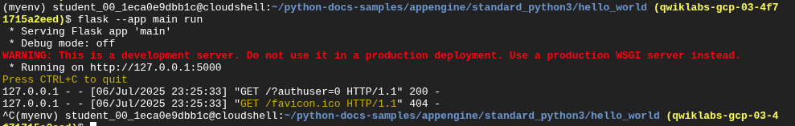
2025-07-27 Update Python so that the greeting of the public facing web application has changed.   
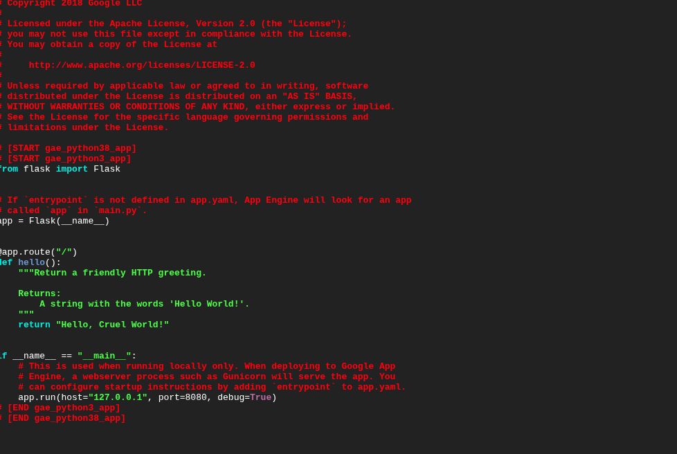
2025-07-27 Validate the application starts and that it is now reachable from a browser.   

2025-07-27 Deploy the web application to the App Engine service.   
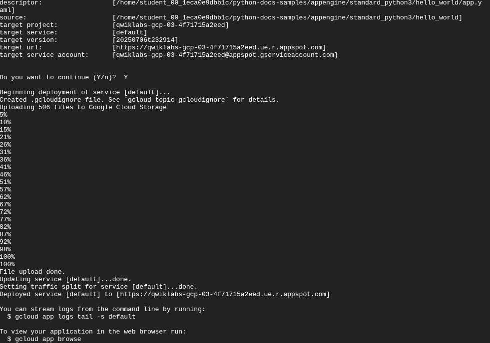
2025-07-27 Confirm the web application change went through and is now reachable via a browser.    
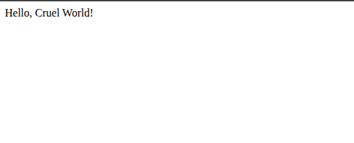

### BillingSpend
2025-07-26 View the past seven days of spend, as well as the projected spend forecast in the billing account overview.  
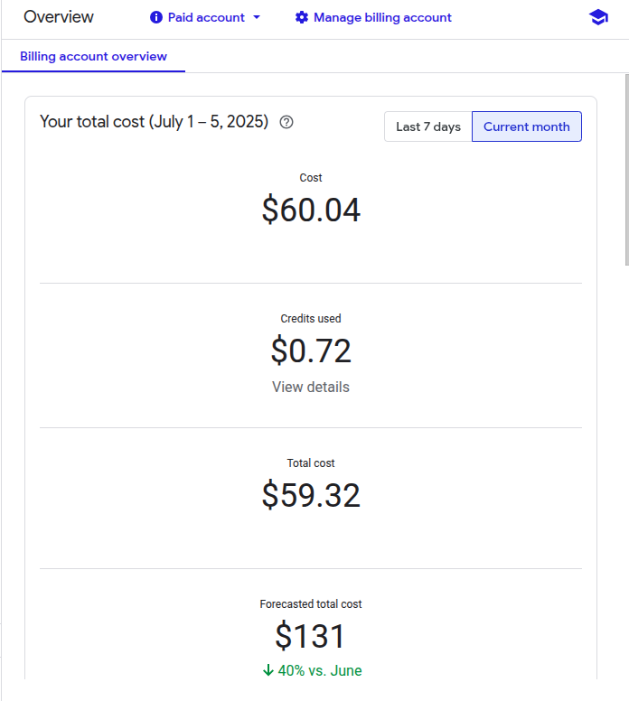
2025-07-26 View the spend report; sorting by the amount each service is costing in a pre-defined spend period.  

2025-07-26 View the cost that each service accrued on a certain day within a targeted spend range.  
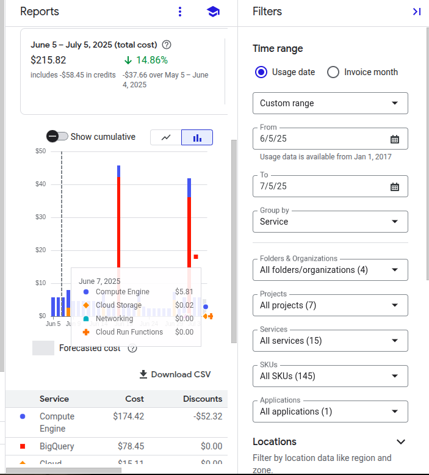
2025-07-26 Filter and view the cost for each service accrued over a certain date by zone and region.  

2025-07-26 View total spend for the month without the Sustained Use discount being applied.  
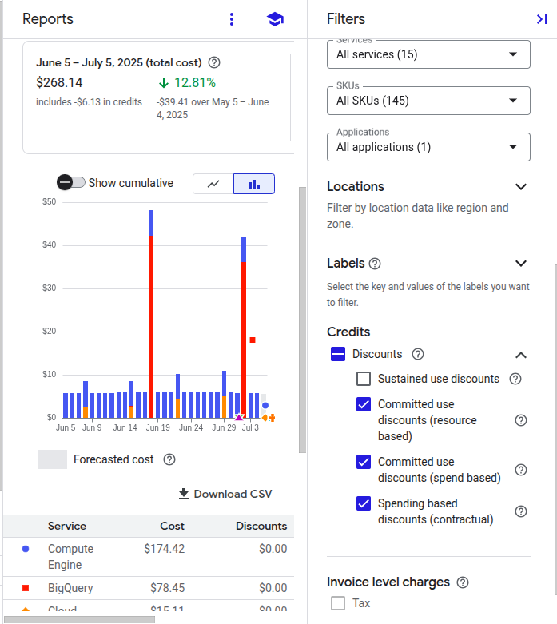
2025-07-26 Filter cost reporting for the month by both the project and the SKU of VMs specified.  
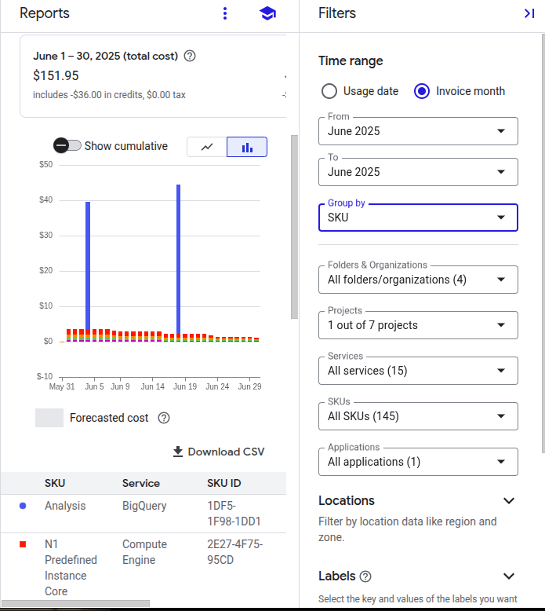
2025-07-26 View the spend for the month for each service by utilized.  
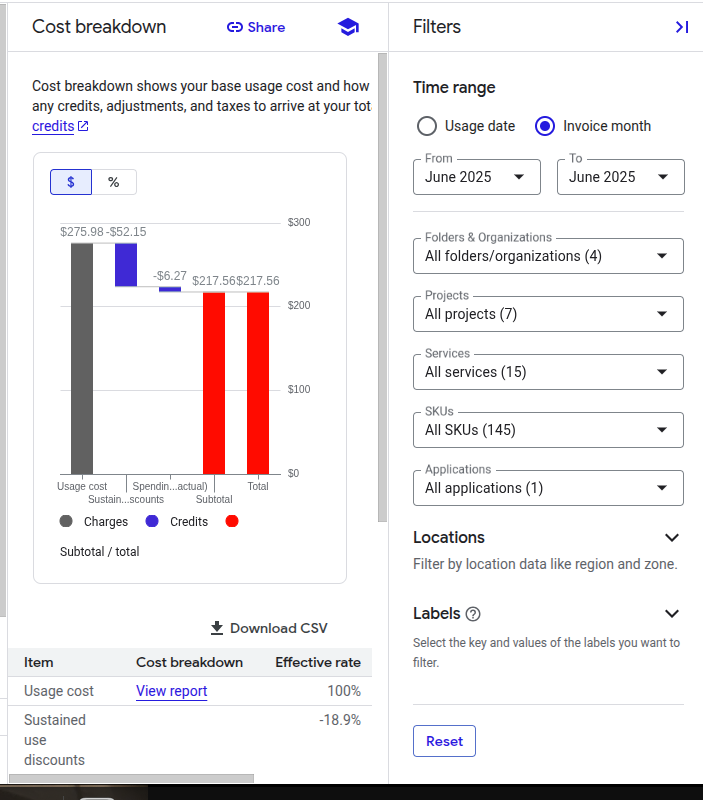

### CloudRun
2025-07-27 Build and Deploy a CloudRun function using the web console.  

2025-07-27 Test the Function Payload and validate the run in logging.  

2025-07-27 Clone the repo, update nodeJS using CloudShell, then start the web server.  

2025-07-27 Confirm the front end GUI is both up and available.  

2025-07-27 Create an artifact repository.  

2025-07-27 Set the repo permissions, start needed services, then start the build process.  

2025-07-27 Pull down files, build Docker image, start services.  

2025-07-27 Validate the build status execution in CloudBuild.  

2025-07-27 Deploy the image to CloudRun.  

2025-07-27 Validate the deployment is running.  

2025-07-27 Redeploy the app with a concurrency of 1, as opposed to the default concurrency of 80.  

2025-07-27 Validate the revised build is showing in CloudRun with the updated concurrency of 1.  

2025-07-27 Validate the second revised build deployed with the default concurrency of 80.  

2025-07-27 Update and push the Docker image(s) with zero downtime for end users. 


### Compute
2025-07-26 Create an e2-medium SKU VM after configuring the $ZONE variable to specify the desired location.  

2025-07-26 Create a Debian VM and validate SSH via CloudShell. 

2025-07-26 Print the VMs to CloudShell.  

2025-07-26 Print out running instances to CloudShell, filtering for the most recently created VM.  

2025-07-26 Create an RSA keypair for the most recently created VM, assign to the active zone, then validate SSH via CloudShell.  

2025-07-26 Install NGINX on the newest created VM.  

2025-07-26 Validate NGINX is up and running on the new VM utilizing curl in CloudShell.  

2025-07-26 Print the current firewall rules for compute; then validate if they are enabled or not.  

2025-07-26 Create a new ingress firewall rule for compute that allows TCP80 (HTTP), set both the priority and tag(s), validate the rule is now enforcing on the VM.  

2025-07-26 Set the region, then assign a VAR for both region and zone.  

2025-07-26 Create a new VM, set the zone and region, select the series, type, OS, bootdisk, and enable required firewall rules.  

2025-07-26 Validate SSH functionality in the browser is functioning as expected.  

2025-07-26 Update the OS, install NGINX, and confirm running on the VM.

2025-07-26 Confirm the web server is available via browser.

2025-07-26 Create a new VM using CloudShell, then validate running.  

2025-07-26 Validate that created VMs are showing as both created and available.  

2025-07-26 Validate SSH functionality for the additional VMs also using CloudShell.  


### ConsoleAPIIAM
2025-07-20 Review currently available projects using the console.  
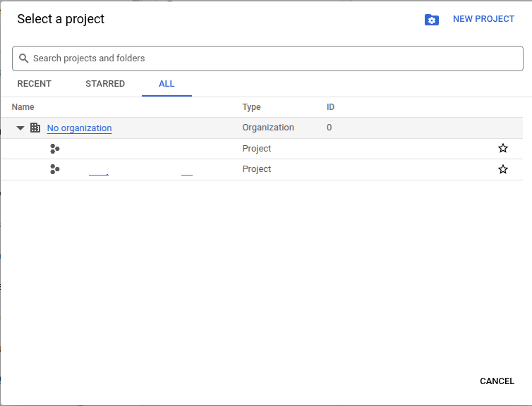
2025-07-20 Navigate to IAM & Admin then Service Accounts.  

2025-07-20 Create a new principal and then confirm it only has the viewer role permission assigned.  
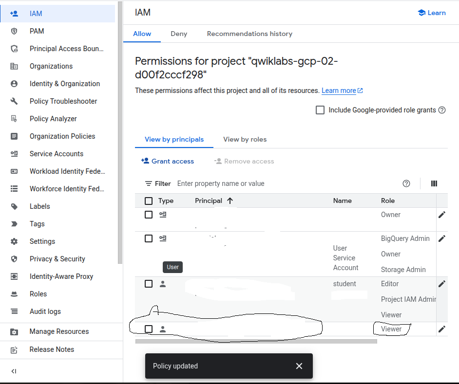
2025-07-20 Confirm the roles assigned to each principal.
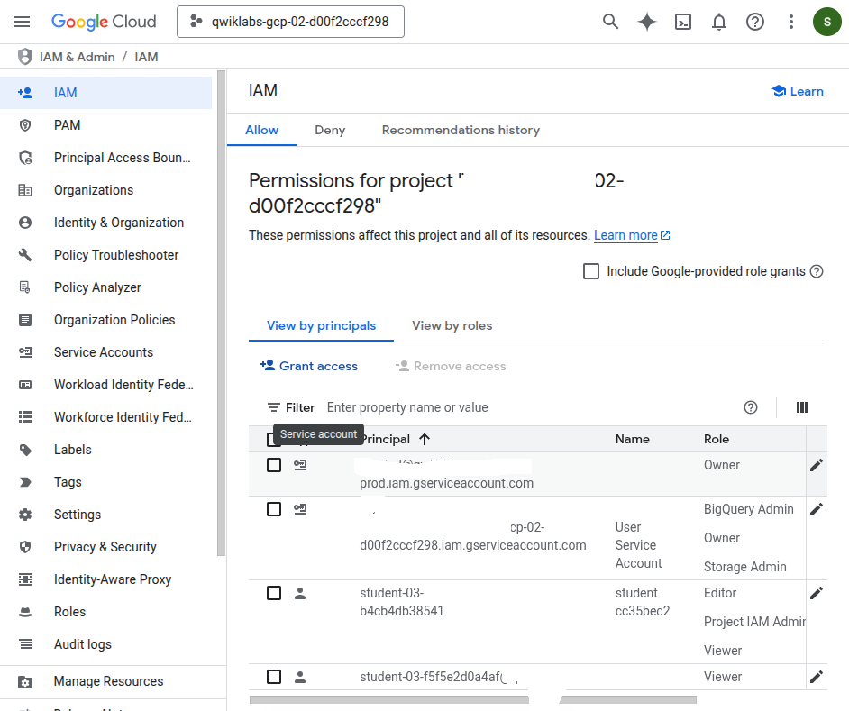
2025-07-20 Enable the Dialogflow API and then confirm that this service is now usable with the current principal.  
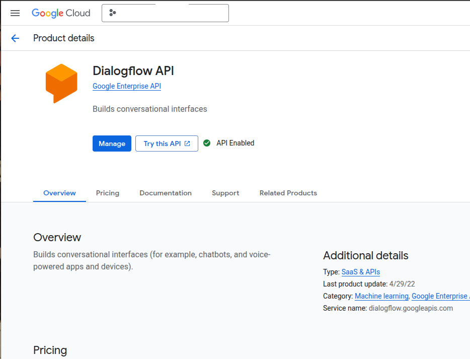
2025-07-20 Confirm the region, change to a different zone in the region, then validate this new zone is active.  
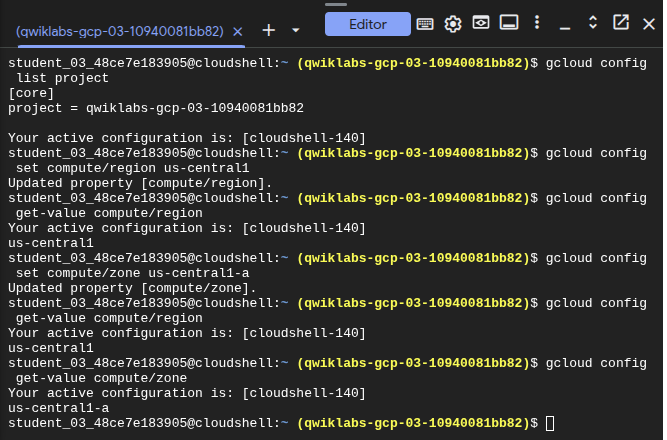
2025-07-20 Export both the PROJECT and ZONE parameters to their respective variables, then echo the output for each to CloudShell.
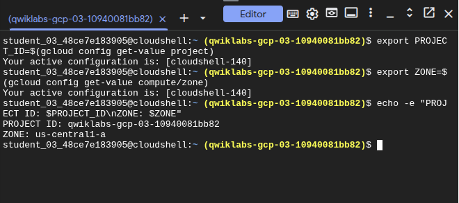

### GKE 
2025-07-27 Set the region and the zone in CloudShell. 

2025-07-27 Create a new GKE cluster with 3 nodes.

2025-07-27 Obtain authentication credentials for new cluster.  

2025-07-27 Create kubernetes service -> expose the app to external traffic -> validate services are running -> confirm the external IP has been generated via CloudShell. 

2025-07-27 Validate the application is available via browser access.

2025-07-27 Delete the cluster then validate this has been completed using CloudShell.  

